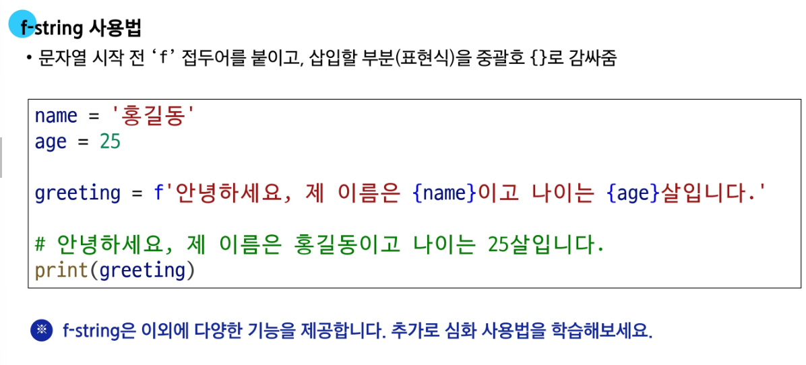
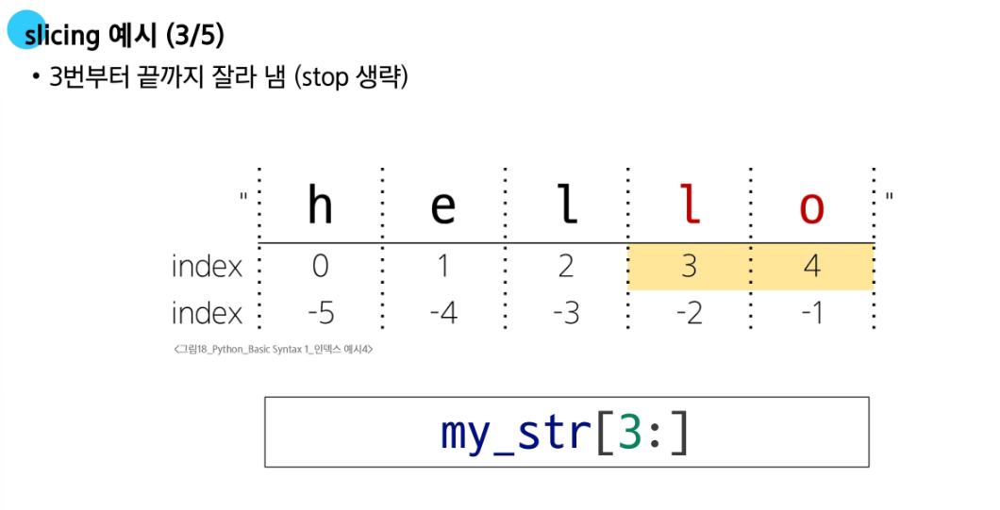
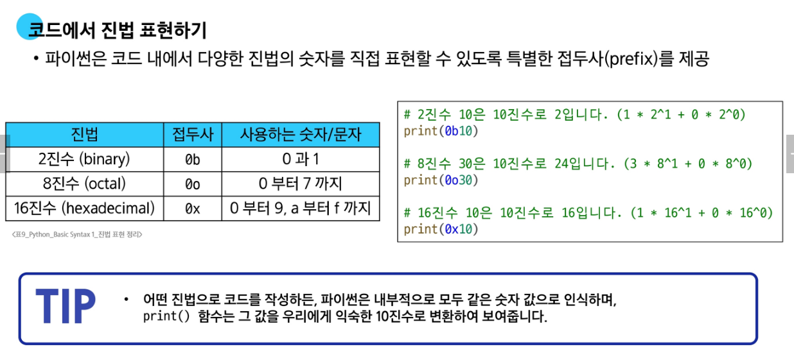
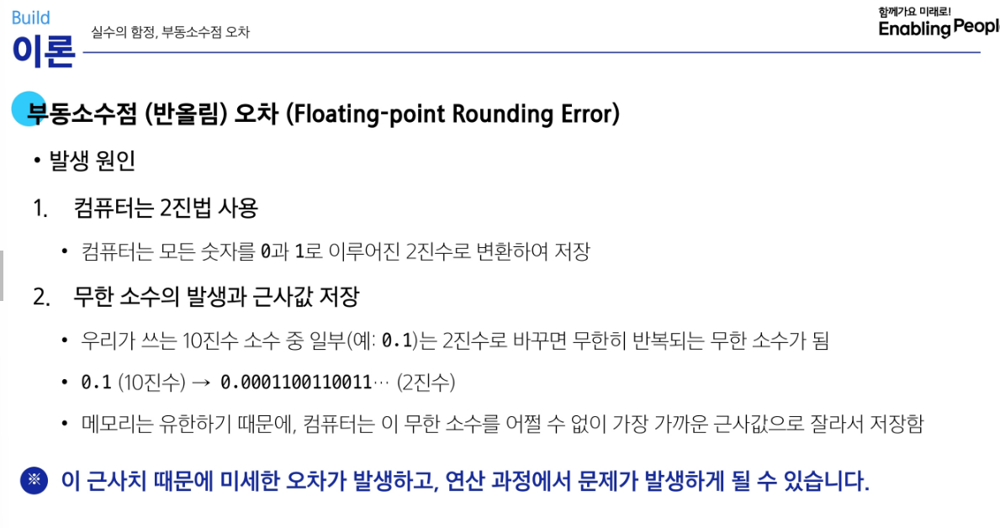
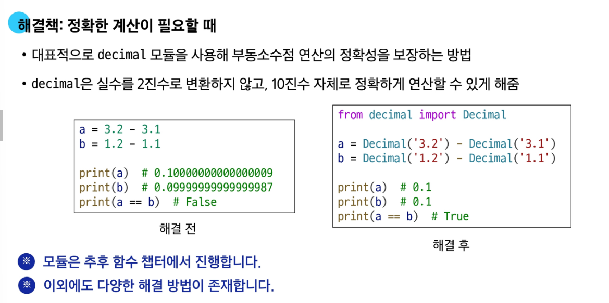
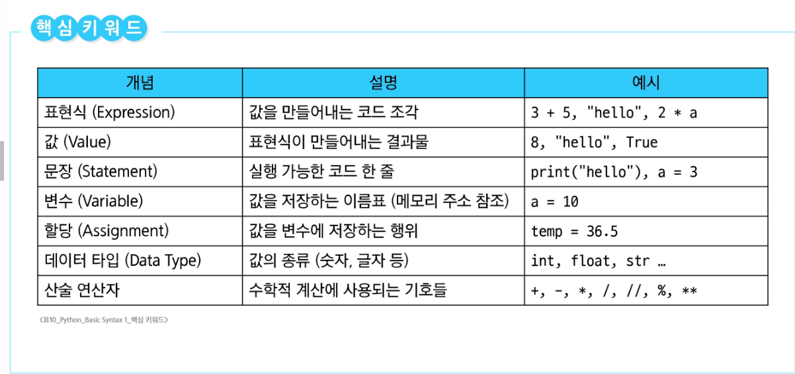

# 🐍 Python 학습 정리

📌 GitLab 저장소: [SSAFL Python 강의 저장소](https://lab.ssafy.com/s14/python/python)

---

## 📘 1. 표현식(Expressions)과 문장(Statements)

- **표현식**: 하나의 값으로 평가될 수 있는 코드 (예: `len("hello")`, `3 + 5`)
- **문장**: 특정 동작을 수행하는 코드의 최소 실행 단위 (예: 할당문, 조건문 등)
- 대부분의 문장은 하나 이상의 표현식을 포함함

---

## 🧱 2. 변수와 객체

- **객체** = 값(value) + 타입(type) + 주소(id)
- **할당문 실행 순서**:
  1. 오른쪽 표현식 먼저 평가
  2. 왼쪽 변수명 확인
  3. 변수명에 결과값 바인딩

---

## ⚙️ 3. 연산자 우선순위

- `**` (거듭제곱)
- 단항 `-` (음수 부호)
- `*`, `/`, `//`, `%`
- `+`, `-`

---

## 📚 4. 시퀀스 자료형 (Sequence Types)

| 타입     | 변경 가능 여부 | 설명 |
|----------|----------------|------|
| `str`    | ❌ 불가능       | 문자들의 순서 있는 시퀀스 |
| `list`   | ✅ 가능         | 가장 일반적인 변경 가능한 시퀀스 |
| `tuple`  | ❌ 불가능       | 수정할 수 없는 시퀀스 |
| `range`  | ❌ 불가능       | 숫자 범위 표현용 시퀀스 (메모리 절약형) |

- 여러 줄 문자열: `"""` 또는 `'''` 사용 가능

---

## ✨ 5. f-string

- 문자열 내에 변수나 표현식 삽입 가능  
  예: `f"Hello, {name}!"`

---

## 🔪 6. 슬라이싱 (Slicing)

- 구문: `s[start:end:step]`
- `start`: 포함, `end`: 제외
- step이 음수면 역순 슬라이싱도 가능

---

## 🔢 7. 진법 표현

- `0b` : 이진수  
- `0o` : 8진수  
- `0x` : 16진수  

---

## 🧮 8. 부동소수점 오차

- 실수는 컴퓨터에서 정확히 표현되지 않음 (예: `0.1 + 0.2 != 0.3`)
- IEEE 754 방식에 따른 **근사값** 표현
- 시스템프로그래밍에서 다룬 내용

---

## 🛠 9. `decimal` 모듈

- `float`의 부정확한 계산을 보완
- 정밀한 소수 계산에 적합

---

## 🗒 10. 주석

- 한 줄 주석: `#`
- 여러 줄 또는 문서용 주석: `""" """` 또는 `''' '''`

---

## 📌 오늘 학습 요약

