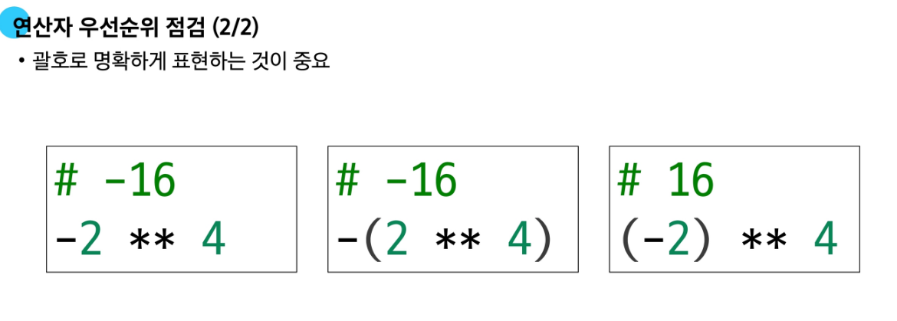

# 🐍 Python 학습 정리

📌 GitLab 저장소: [SSAFL Python 강의 저장소](https://lab.ssafy.com/s14/python/python)

---

## 📘 1. 표현식(Expressions)과 문장(Statements)

- **표현식**: 하나의 값으로 평가될 수 있는 코드 (예: `len("hello")`, `3 + 5`)
- **문장**: 특정 동작을 수행하는 코드의 최소 실행 단위 (예: 할당문, 조건문 등)
- 대부분의 문장은 하나 이상의 표현식을 포함함

---

## 🧱 2. 변수와 객체

- **객체** = 값(value) + 타입(type) + 주소(id)
- **할당문 실행 순서**:
  1. 오른쪽 표현식 먼저 평가
  2. 왼쪽 변수명 확인
  3. 변수명에 결과값 바인딩

---

## ⚙️ 3. 연산자 우선순위

- `**` (거듭제곱)
- 단항 `-` (음수 부호)
- `*`, `/`, `//`, `%`
- `+`, `-`



---

## 📚 4. 시퀀스 자료형 (Sequence Types)

| 타입     | 변경 가능 여부 | 설명 |
|----------|----------------|------|
| `str`    | ❌ 불가능       | 문자들의 순서 있는 시퀀스 |
| `list`   | ✅ 가능         | 가장 일반적인 변경 가능한 시퀀스 |
| `tuple`  | ❌ 불가능       | 수정할 수 없는 시퀀스 |
| `range`  | ❌ 불가능       | 숫자 범위 표현용 시퀀스 (메모리 절약형) |

- 여러 줄 문자열: `"""` 또는 `'''` 사용

---

## ✨ 5. f-string

- 문자열 안에 표현식 삽입 가능:  
  ```python
  name = "Alice"
  print(f"Hello, {name}!")
