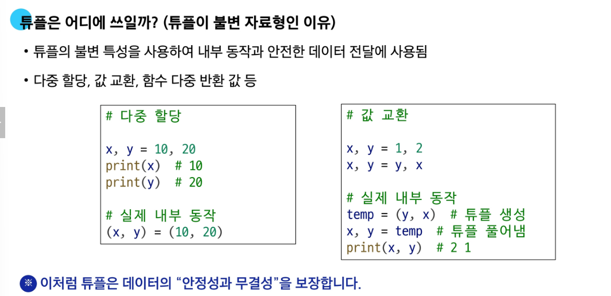
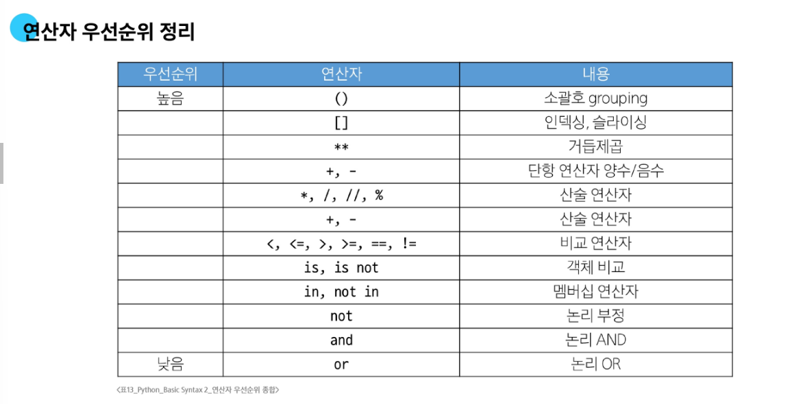

# 🧠 Python 기초 자료형 및 연산 정리

---

## 📦 컬렉션(Collection) 개요

- 여러 값을 하나로 묶어 관리할 수 있는 자료형
- **컬렉션 자료형**: `str`, `list`, `tuple`, `range`, `set`, `dict`
- 이 중에서 **순서가 있는 것**은 **시퀀스(sequence)**, 나머지는 비시퀀스


---

## 📋 리스트 (List)

- `[]` 대괄호 사용
- **mutable (변경 가능)**한 순서 있는 시퀀스 자료형

```python
fruits = ['apple', 'banana', 'cherry']
fruits[0] = 'grape'  # 변경 가능
```

---

## 📦 튜플 (Tuple)

- `()` 소괄호 또는 생략 가능
- **immutable (변경 불가능)**한 순서 있는 시퀀스
- 요소가 하나인 튜플은 반드시 **trailing comma(후행 쉼표)**를 사용해야 함

### ✅ Trailing Comma 예시

```python
one = ('only one',)  # 튜플
not_tuple = ('only one')  # 문자열

# 다중 요소일 때 trailing comma는 선택사항
person = (
    'name',
    'age',
    'email',  # ← 있어도 되고 없어도 됨
)
```



---

## 🔁 Range

- `range(start, stop, step)` 형식
- **immutable**
- `range()` 자체는 `range(0, 10)` 식으로 보이고, 값을 보려면 `list()`로 변환해야 함

```python
r = range(5)
print(r)         # range(0, 5)
print(list(r))   # [0, 1, 2, 3, 4]
```

- `start >= end`이면 `[]` 빈 리스트 출력됨

---

## 🗂️ 딕셔너리 (Dictionary)

- 중괄호 `{}` 사용
- **mutable**, 순서 있음 (Python 3.7+), **키는 중복 불가**
- 키는 `str`, `int`, `float`, `tuple` 등의 불변 자료형만 가능

```python
data = {'name': 'Alice', 'age': 30}
data['age'] = 31  # 변경
data['city'] = 'Seoul'  # 추가
```

- 리스트나 딕셔너리는 키로 사용할 수 없음
- 값은 어떤 자료형이든 가능

---

## 🧮 세트 (Set)

- 중괄호 `{}` 사용하지만 딕셔너리와 혼동 주의
- **중복 없음, 순서 없음, mutable**
- 빈 세트는 `set()`으로 만들어야 함

```python
s = set([1, 2, 3, 1, 2])
print(s)  # {1, 2, 3}
```

### 집합 연산 예시


---

## 🔄 불변 vs 가변


---

## 🔢 타입 변환 (Type Casting)

- `int()`로 `float`을 정수로 바꾸면 소수점은 **버림**

```python
print(int(3.9))  # 3
```


---

## 🔍 비교 연산자

- `<`, `<=`, `==`, `!=`, `>`, `>=`
- `is`, `is not` → **같은 객체인지(메모리 주소)**를 비교
- `1 == True` → `True`
- `2 == 2.0` → `True`

---

## 🧊 싱글턴 객체

- `is` 연산자는 주로 **`None` 같은 싱글턴 객체 비교**에 사용

```python
a = None
print(a is None)  # True
```


```python
a = [1, 2]
b = a
print(a is b)  # True, 같은 객체 참조
```

---

## 🔁 논리 연산자

- `not`, `and`, `or`
- `not 0` → `True` (0은 False로 취급됨)
- `False`로 취급되는 값들: `False`, `0`, `''`, `[]`, `None`

---

## ⚡ 단축 평가 (Short-circuit Evaluation)

- `and`: 처음 만나는 **False**를 반환. 모두 True면 마지막 True 반환
- `or`: 처음 만나는 **True**를 반환. 모두 False면 마지막 False 반환


---

---

## 🧬 얕은 복사 vs 깊은 복사

- `a = b` 는 복사가 아니라 **참조 전달**임 (같은 객체를 가리킴)
- 복사의 종류에는 **얕은 복사(shallow copy)**와 **깊은 복사(deep copy)**가 있음

### ✅ 얕은 복사 (Shallow Copy)

- 외부 객체는 새로 복사되지만, 내부 객체는 **같은 참조를 공유**
- 복사 방법: `list(a)`, `a[:]`, `copy.copy()`

```python
import copy

a = [[1, 2], [3, 4]]
b = a[:]  # 얕은 복사

b[0][0] = 999
print(a)  # [[999, 2], [3, 4]] → 내부 리스트는 공유됨
```

## 🔗 시퀀스형 연산자

- 같은 자료형끼리만  `+`, `*` 가능

```python
print([1, 2] + ['a', 'b'])  # [1, 2, 'a', 'b']
```
```python
import copy

a = [[1, 2], [3, 4]]
b = copy.deepcopy(a)

b[0][0] = 999
print(a)  # [[1, 2], [3, 4]] → 완전히 분리됨
print(b)  # [[999, 2], [3, 4]]
```

---

## 📐 연산자 우선순위

- `**` > `+`, `-`, `*`, `/` 등
- 우선순위가 같은 경우 → **왼쪽에서 오른쪽**

