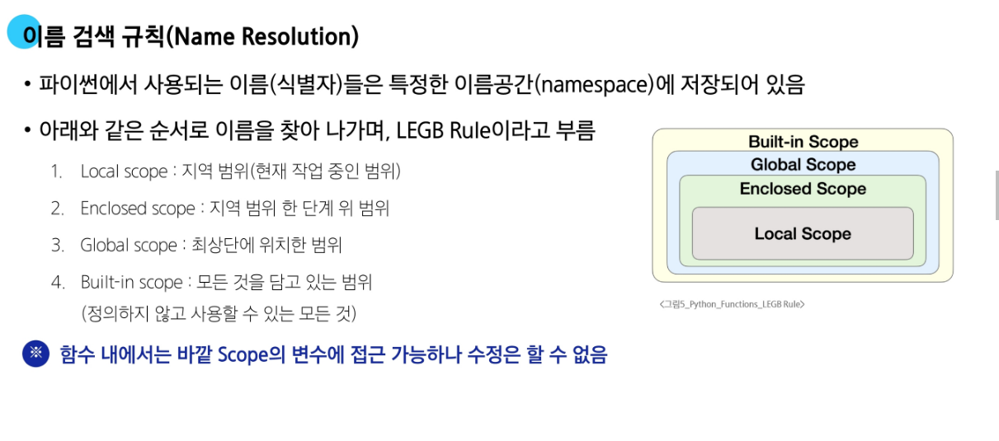
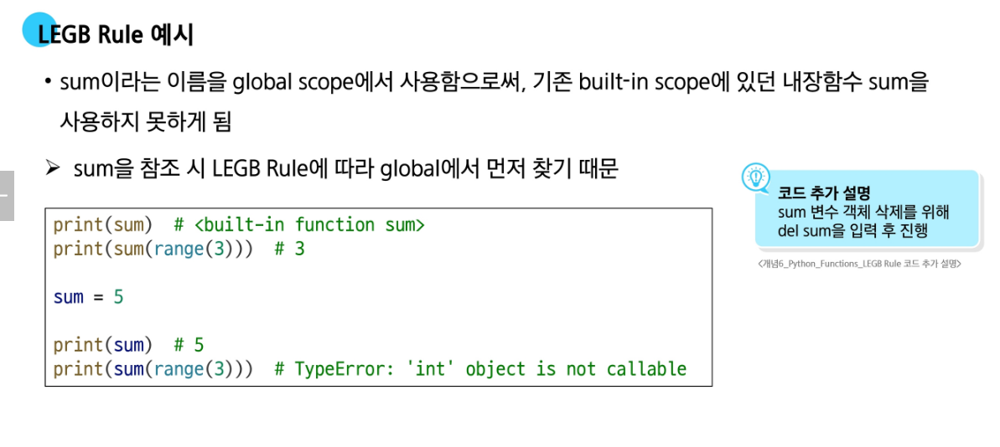
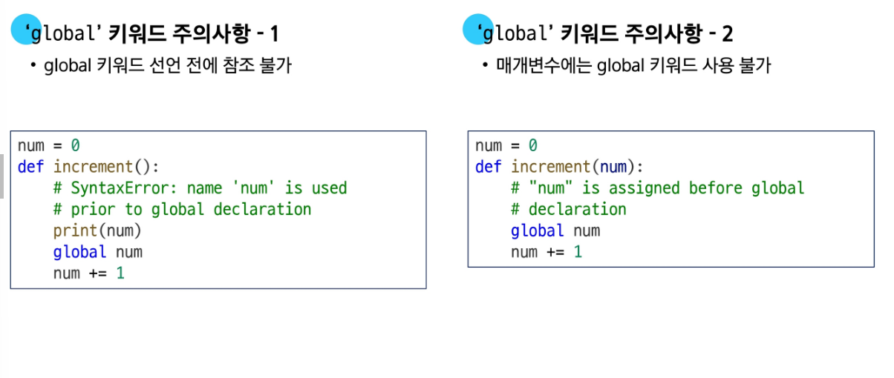
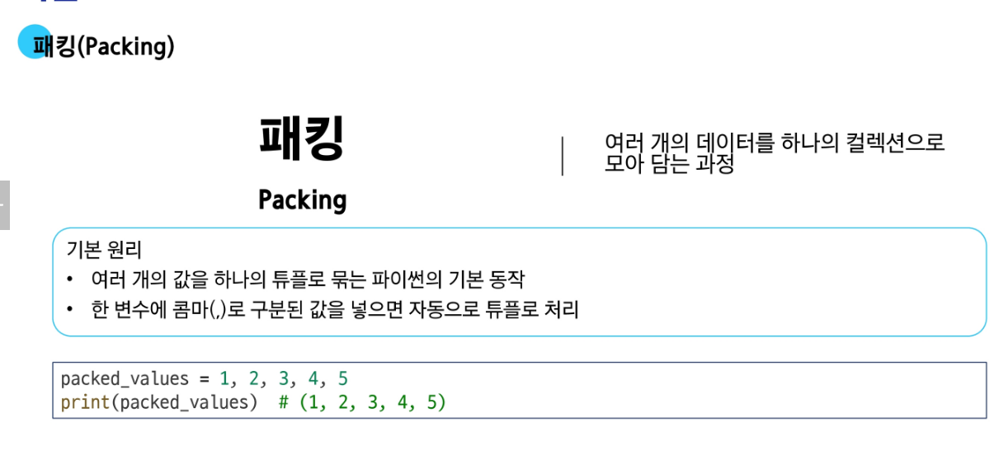
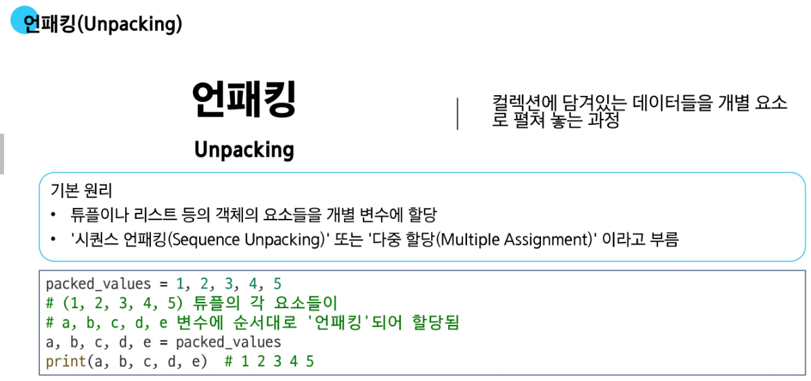
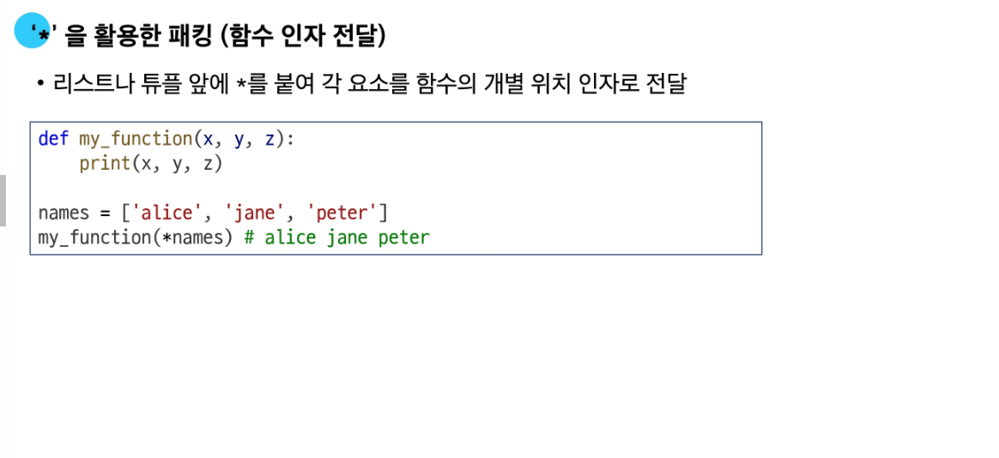
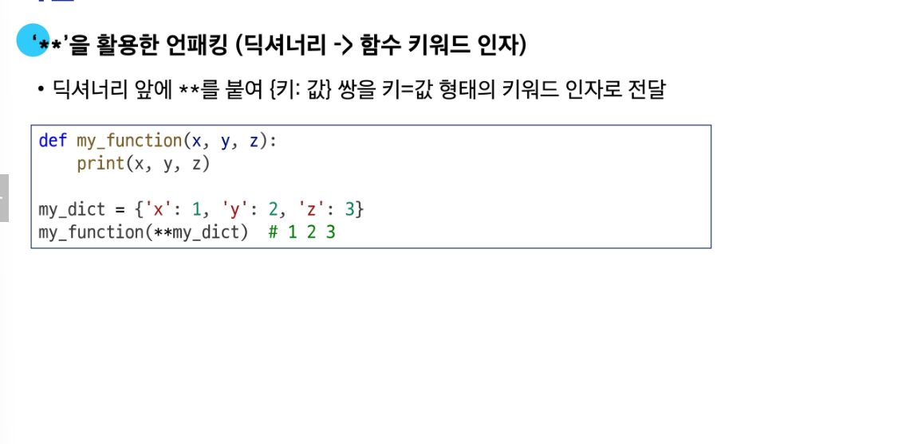

## 🧩 함수란?
- **재사용 가능한 코드의 묶음**
- 함수의 **본문(body)**에 `""" Docstring """`을 작성하여 동작/기능을 설명할 수 있음 (선택사항)
- `return` 문이 없으면 **`None`을 반환**
- `print()` 함수는 **값을 반환하지 않고**, 단지 콘솔에 출력만 함 (`return None`)
- **parameter(매개변수)**: 함수를 **정의**할 때 지정하는 변수  
- **argument(인자)**: 함수를 **호출**할 때 전달하는 실제 값

---

## 🧾 함수의 인자 종류

### 1. 위치 인자 (Positional Arguments)
- 순서대로 인자를 전달해야 함

### 2. 기본 인자 (Default Arguments)
- 기본값을 가진 인자
- 정의 시 항상 **위치 인자 뒤에 위치**

### 3. 키워드 인자 (Keyword Arguments)
- `key=value` 형태로 명시적 전달
- **항상 위치 인자보다 뒤에** 와야 함  
- **순서는 중요하지 않음**

### 4. 임의 인자 목록 (`*args`)
- 개수 제한 없이 위치 인자를 받을 수 있음  
- 함수 내부에서 **튜플**로 처리됨

### 5. 임의 키워드 인자 목록 (`**kwargs`)
- 개수 제한 없이 키워드 인자를 받을 수 있음  
- 함수 내부에서 **딕셔너리**로 처리됨

### 📌 인자 정의 순서 (권장)
```
위치 인자 → 기본 인자 → *args → 키워드 인자 → **kwargs
```

---

## 🔁 재귀 함수 (Recursive Function)
- 함수 내부에서 **자기 자신을 호출**
- 반드시 **종료 조건(base case)**이 필요
- 종료 조건이 없거나 잘못되면 **stack overflow** 발생
- 일반적으로 **메모리 사용량이 많고 느릴 수 있음**

---

## 🧰 내장 함수 (Built-in Functions)
- `print()`, `len()`, `type()` 등과 같이  
  **`import` 없이 바로 사용 가능한 함수들**

---

## 🧠 함수와 변수의 Scope (범위)

### 💡 Scope의 종류와 생명주기

| Scope 유형       | 생성 시점               | 소멸 시점                      |
|------------------|--------------------------|-------------------------------|
| Built-in Scope   | 파이썬 인터프리터 실행 시 | 프로그램 종료 시까지          |
| Global Scope     | 모듈 로드 시              | 인터프리터 종료 시까지        |
| Local Scope      | 함수 호출 시              | 함수 종료 시까지              |

### 🔎 LEGB Rule  
> 변수 이름을 찾는 순서:  
> **L**ocal → **E**nclosing → **G**lobal → **B**uilt-in

- 
- 

---

## 🌐 global 키워드
- 함수 내부에서 전역변수를 **읽는 것만** 하는 건 괜찮지만,  
- 값을 **수정하려면 `global` 키워드를 명시해야 함**

- 

---

## 📦 패킹(Packing)과 언패킹(Unpacking)

### ✅ 패킹(Packing)
- `*` → 위치 인자들을 **튜플로 패킹**
- `**` → 키워드 인자들을 **딕셔너리로 패킹**
- `print()` 함수도 내부적으로 `*args`를 이용하여 인자를 패킹함

- 

### ✅ 언패킹(Unpacking)
- `*` → 튜플/리스트를 **언패킹**하여 여러 인자로 분해
- `**` → 딕셔너리를 **언패킹**하여 키워드 인자로 분해

- 
- 
- 

---

## 🎁 함수와 반환값

```python
a = get_user()
```

- 위 코드에서 `get_user()` 함수가 `return a, b`를 하면
- 실제 반환값은 `(a, b)`라는 **튜플 하나**이고, 이 튜플이 변수 `a`에 그대로 들어간다
- 이유: `return`은 **반드시 하나의 객체만 반환**하기 때문

---

## ⚡️ lambda 함수

```python
lambda x, y: x + y
```

- `x`, `y`는 인자 (arguments)  
- `x + y`는 반환값  
- `lambda` 함수는 **익명 함수(이름이 없는 함수)**  
- 일시적으로 짧은 함수가 필요할 때 유용