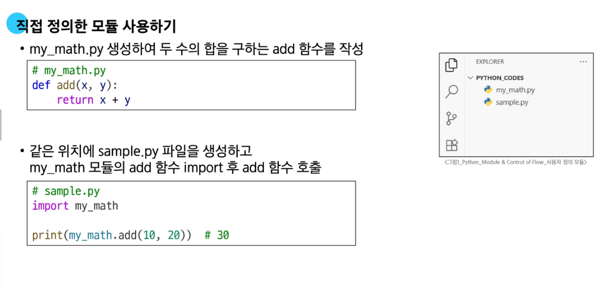
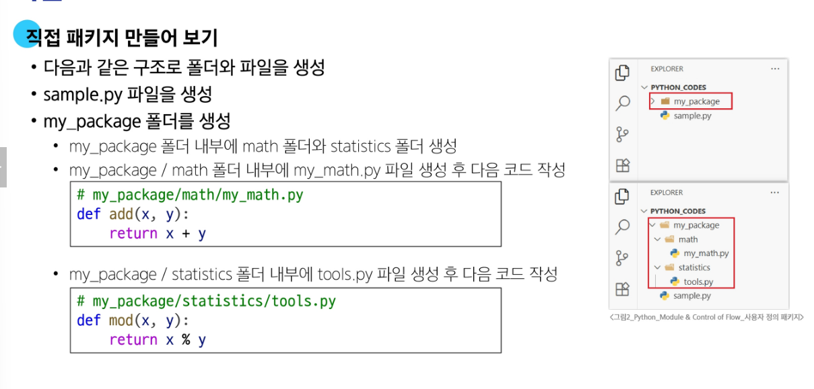
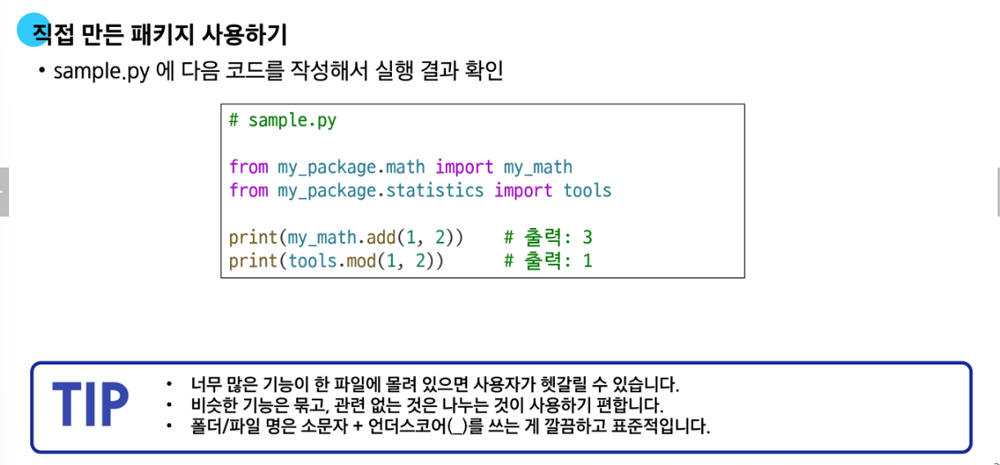
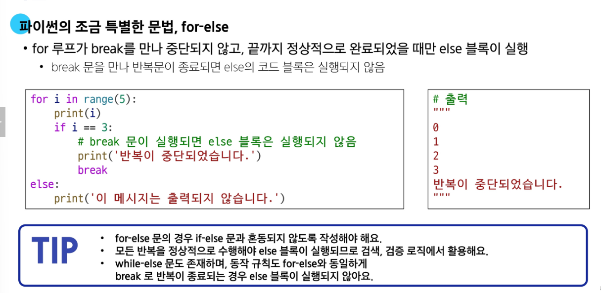
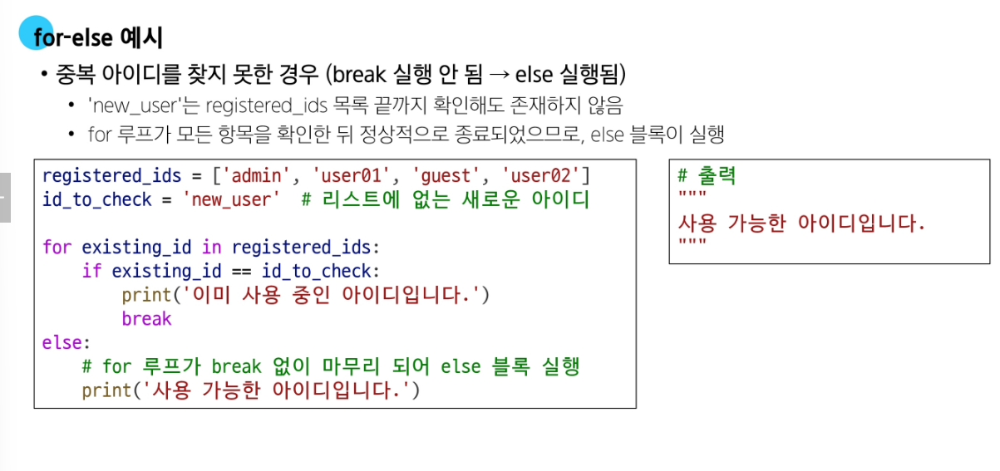
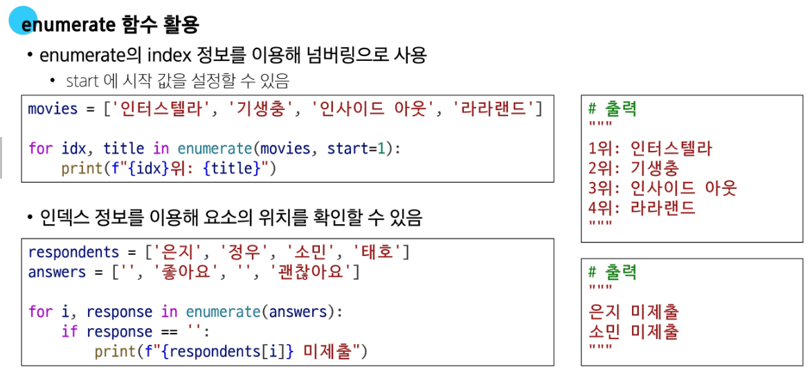

## 📁 모듈 (Module)

- 모듈은 하나의 `.py` 파일에 정의된 변수, 함수, 클래스 등의 **모음**
- 표준 모듈 또는 사용자 정의 모듈을 `import`를 통해 사용
- **예시**:

```python
from math import sqrt
math_result = sqrt(16)  # 실수형 4.0

def sqrt(x):
    return str(x ** 0.5)

my_result = sqrt(16)    # 문자열 '4.0'
```

- 위와 같이 같은 이름(`sqrt`)이 중복되면, 가장 **나중에 정의된 것이 앞의 것을 덮어쓴다**
- `from module import *`는 **중복 위험**이 있어 권장되지 않음
- `import module as alias` 형태로 **이름 충돌을 방지**하거나, **긴 이름을 축약**할 수 있음
- 같은 디렉터리 내 다른 `.py` 파일에서 사용자 정의 모듈을 import 가능



---

## 📦 패키지 (Package)

- 여러 개의 모듈(.py)을 **디렉터리 단위로 묶은 것**
- 디렉터리 안에 `__init__.py` 파일이 있으면 패키지로 인식 (Python 3.3 이후는 선택적)
- 사용 예시:




- **표준 라이브러리(PSL)** 예:
  - `math`, `os`, `sys`, `random` 등
  - 설치 없이 바로 사용 가능
- **외부 패키지**는 `pip`으로 설치

```bash
pip install somePackage
pip install somePackage==1.0.5
pip install somePackage>=1.0.4
```

- 패키지를 사용하는 목적:
  - **이름 공간(namespace) 충돌 방지**
  - **모듈 관리의 효율성 향상**

---

## 🔁 For 문

- **iterable한 객체**의 요소를 반복 처리
- iterable: `list`, `tuple`, `str` 같은 **시퀀스**와 `dict`, `set` 같은 **비시퀀스** 포함
- `dict`는 기본적으로 **키(key)**를 기준으로 반복됨
- `dict`는 **Python 3.7 이상부터 삽입 순서가 보장됨**

```python
my_dict = {'x': 10, 'y': 20, 'z': 30}
for key in my_dict:
    print(key, my_dict[key])
```

---

## 🔁 for-else 문

- `for` 루프가 `break` 없이 **끝까지 실행**되면 `else` 블록 실행
- `while-else` 도 동일한 구조




---

## 🧮 map() 함수

- `map(function, iterable)` 형태
- `function`을 `iterable`의 모든 요소에 적용한 **map 객체** 반환
- **형변환 필요**: `list(map(...))` 또는 `tuple(map(...))`
- 문자열 입력 처리 시:

```python
# 공백 구분 입력
numbers = list(map(int, input().split()))

# 단일 문자열 입력
chars = list(map(str, input()))
```

---

## 🔗 zip() 함수

- `zip(*iterables)`로 여러 iterable의 요소를 묶어서 **tuple의 iterator** 반환
- **형변환 필요**: `list(zip(...))`, `tuple(zip(...))`
- 가장 짧은 iterable을 기준으로 묶음
- `for` 루프에서 언패킹 가능
- **2차원 리스트의 전치(transpose)** 시 유용

```python
matrix = [
    [1, 2, 3],
    [4, 5, 6]
]
transposed = list(zip(*matrix))
print(transposed)  # [(1, 4), (2, 5), (3, 6)]
```


---

## 🔢 enumerate() 함수

- `enumerate(iterable, start=0)`  
- index와 값을 함께 반환하는 **enumerate 객체** 생성

```python
fruits = ['apple', 'banana', 'cherry']
for idx, val in enumerate(fruits):
    print(idx, val)
```

- 반환값은 `(index, value)` 형태의 튜플
- `list(enumerate(...))`로 변환 가능



---

## ✅ 요약 비교

| 함수        | 설명                                 | 반환형         | 형변환 필요 |
|-------------|--------------------------------------|----------------|--------------|
| `map()`     | 함수 적용 결과 반환                  | map 객체       | ✅ 필요      |
| `zip()`     | 여러 iterable 묶어서 튜플로 반환     | zip 객체       | ✅ 필요      |
| `enumerate()`| index + 값 튜플 반환                | enumerate 객체 | ⛔ 불필요 (for에서 직접 사용) |

---
