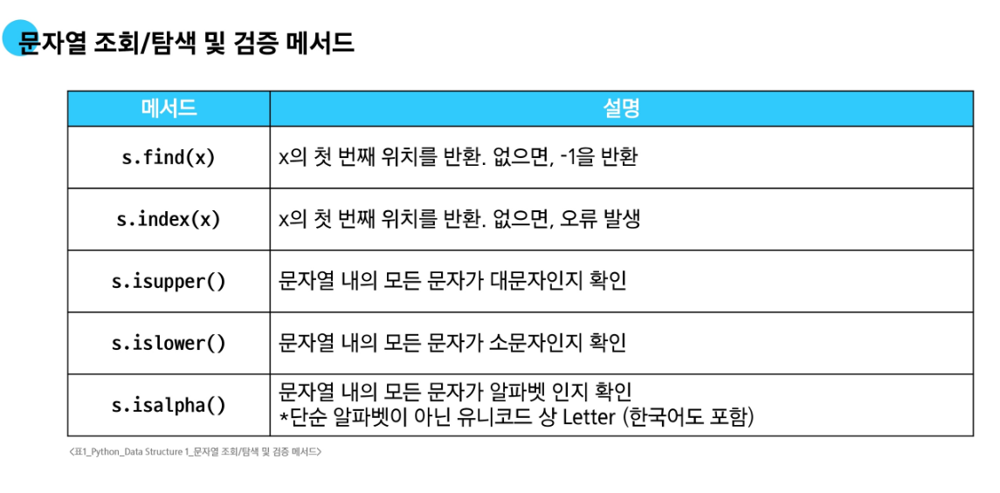
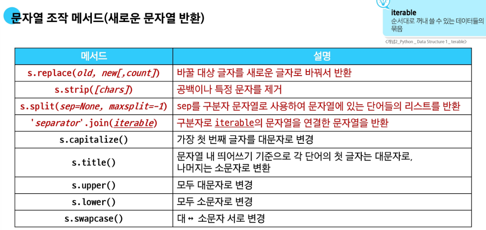
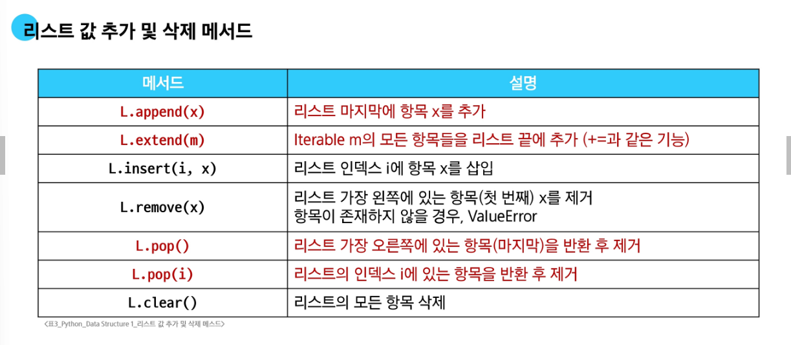
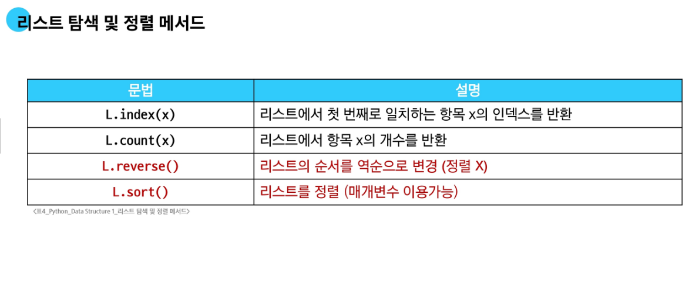
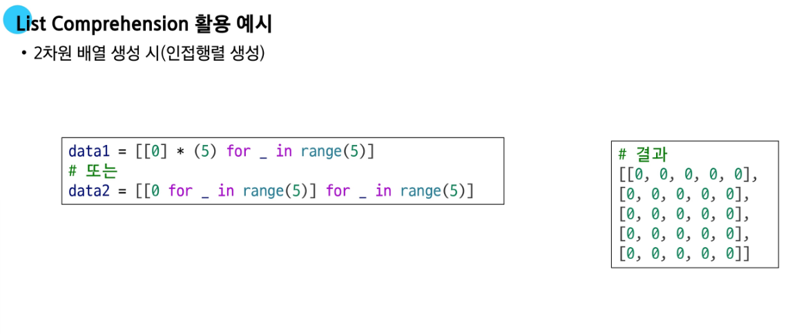
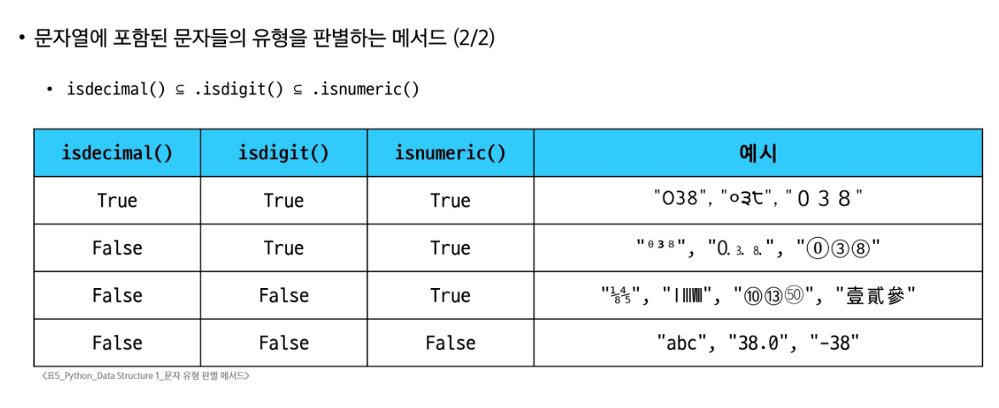

# 🐍 Python 기초 메서드 정리

---

## 📌 메서드란?
- 객체가 특정 작업을 수행하도록 정의된 함수
- 클래스 내부에 정의되며, 객체에 속해 있음
- 메서드는 해당 객체의 데이터를 처리하거나 반환하는 방식으로 작동함

## 📌 용어 정리
| 용어 | 설명 |
|------|------|
| 객체 (Object) | 데이터와 메서드를 함께 가진 실체 |
| 클래스 (Class) | 객체의 설계도이자 데이터 타입 |
| 인스턴스 (Instance) | 클래스로부터 생성된 개별 객체 |
| 메서드 (Method) | 클래스 내부에 정의된 함수. 객체가 가진 함수 |

---

## 📝 문자열 메서드

### 주요 메서드 정리
  


### 주요 특징
- 문자열은 **immutable** → 모든 메서드는 **새 문자열을 반환**하고, 원본은 변하지 않음

### 메서드별 설명

- `find(sub)`: `sub` 문자열이 처음 등장하는 **인덱스** 반환. 없으면 `-1` 반환 (❗오류 발생 안 함)
- `index(sub)`: `sub` 문자열의 첫 인덱스 반환. **없으면 오류 (`ValueError`) 발생**
- `isalpha()`: 유니코드 기준 → 한글도 문자로 포함
- `replace(old, new, count)`: `old`를 `new`로 바꿈. `count`는 **왼쪽부터 최대 몇 번 바꿀지 지정**
- `join(iterable)`: 문자열 사이에 `""`를 넣어 iterable을 연결  
  👉 예: `".".join(['a', 'b', 'c'])` → `'a.b.c'`
- `capitalize()`: **맨 앞 글자만 대문자**, 나머지는 소문자
- `title()`: **단어 단위로 첫 글자만 대문자**, 나머지는 소문자 (공백 기준)
- `split(sep=None, maxsplit=-1)`: 문자열을 `sep` 기준으로 나누어 리스트로 반환  
  - `sep`: 구분자. 생략하면 공백 기준
  - `maxsplit`: 나눌 **최대 횟수** (❗몇 개 그룹으로 나눈다는 뜻이 아님)
  - 최대 생성 그룹 수는 `maxsplit + 1`

#### ✅ split 예제

```python
s = "a b c d e"

print(s.split())  # ['a', 'b', 'c', 'd', 'e']
print(s.split(" ", maxsplit=2))  # ['a', 'b', 'c d e']
print(s.split("x"))  # ['a b c d e'] → 구분자 없으면 그대로 반환
```

---

## 🧺 리스트 메서드

### 주요 메서드 정리
  


### 특징
- 리스트는 **mutable** → 대부분 메서드가 **원본 리스트를 직접 수정하며 반환값이 없음**

### 메서드별 설명

- `append(x)`: x를 맨 뒤에 추가 (리스트 전체 삽입 아님)
- `extend(iterable)`: iterable 요소들을 리스트에 풀어서 추가  
  - `append([1,2])` → 리스트 자체 추가  
  - `extend([1,2])` → 리스트 내용이 펼쳐져 추가됨
- `insert(i, x)`: 인덱스 `i` 위치에 `x` 삽입 (오른쪽 요소들 밀림)
- `remove(x)`: 값이 `x`인 첫 요소 삭제 (없으면 오류 발생)
- `pop(i=-1)`: 인덱스 `i`의 요소 제거 후 **반환**
- `index(x)`: 값이 `x`인 첫 요소의 **인덱스 반환** (없으면 `ValueError`)
- `sort()`: 리스트 **제자리 정렬**, 반환값은 `None`
- `reverse()`: 리스트 **제자리 반전**, 반환값은 `None`

### ❗주의: 반환값이 `None`인 메서드

```python
nums = [3, 1, 2]
result = nums.sort()
print(result)  # None
```

→ 해결: `sorted()` 함수 사용

```python
result = sorted(nums)  # [1, 2, 3]
```

---

## 🔁 복사 (Copy)

### 📌 타입 분류

| 타입 | 가변성 |
|------|--------|
| `list`, `dict`, `set` | ✅ mutable |
| `int`, `str`, `float`, `tuple` | ❌ immutable |

### 변수 할당은 **객체의 참조를 복사**함

```python
a = [1, 2, 3]
b = a       # 같은 주소를 가리킴
b[0] = 99
print(a)    # [99, 2, 3] → a도 변경됨
```

---

### 1️⃣ 얕은 복사 (shallow copy)

- 최상위 객체는 복사되지만, 내부 객체는 참조만 복사됨

```python
a = [[1, 2], [3, 4]]
b = a.copy()

b[0][0] = 99
print(a)  # [[99, 2], [3, 4]] → 내부 객체는 공유됨
```

- 구현 방법:
  - `a.copy()`
  - `a[:]`
  - `list(a)`

---

### 2️⃣ 깊은 복사 (deep copy)

- 내부의 중첩 객체까지 전부 복사

```python
import copy

a = [[1, 2], [3, 4]]
b = copy.deepcopy(a)

b[0][0] = 99
print(a)  # [[1, 2], [3, 4]] → 원본 유지
```

---

### ✅ 메모리 구조 참고 이미지


---

## 🔁 리스트 컴프리헨션

### 2차원 배열 생성 예시

```python
arr = [[0 for _ in range(3)] for _ in range(4)]
print(arr)
# [[0, 0, 0], [0, 0, 0], [0, 0, 0], [0, 0, 0]]
```



---

## 🔗 Method Chaining

- 메서드가 **객체를 반환할 때만** 메서드 체이닝 가능

```python
nums = [3, 1, 2]
result = nums.copy().sort()
print(result)  # None ← sort는 반환값 없음

result_2 = sorted(nums.copy())  # ✅ 올바른 체이닝
print(result_2)  # [1, 2, 3]
```

---

## 🔤 문자열 타입 판별 메서드

| 메서드 | 설명 | 예시 |
|--------|------|------|
| `isalpha()` | 유니코드 기반, 한글도 포함 | "가나다".isalpha() → True |
| `isdigit()` | 0~9만 인식 | "123".isdigit() → True |
| `isdecimal()` | 소수, 분수, 지수 ❌ | "Ⅳ".isdecimal() → False |
| `isnumeric()` | 분수, 로마숫자, 제곱근도 인식 | "Ⅳ".isnumeric() → True |



---

**✅ Tip:**  
- `isdecimal() ⊂ isdigit() ⊂ isnumeric()`