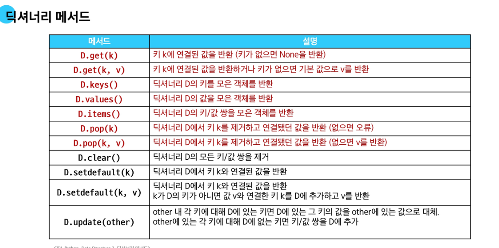
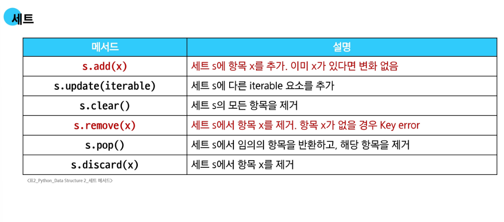
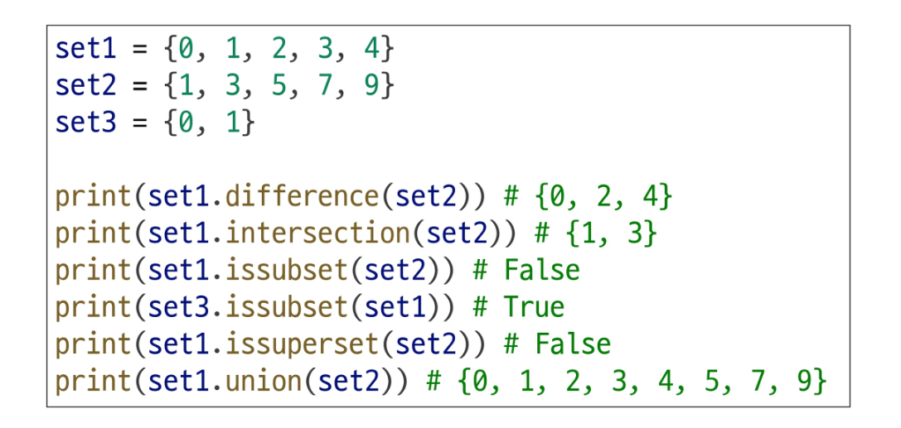

## 📘 Dictionary (딕셔너리)

* **빠른 검색, 삽입, 삭제**

  * 내부적으로 해시 테이블을 사용해, 데이터 크기와 상관없이 평균적으로 매우 빠름 (O(1) 시간복잡도)
* **키는 고유하고, hashable(해시 가능한) 객체여야 함**

  * 키는 중복 불가. 마지막 값이 이전 값을 덮어씀
  * 예: `dict = {"a": 1, "b": 2}`



### ✅ 주요 메서드

| 메서드                             | 설명                                             |
| ------------------------------- | ---------------------------------------------- |
| `dict.get(key, default=None)`   | 키가 존재하면 값을 반환, 없으면 `default` 값 반환 (`None` 기본값) |
| `dict.pop(key)`                 | 키가 존재하면 제거 후 값을 반환, 없으면 `KeyError` 발생          |
| `dict.pop(key, default)`        | 키가 없으면 `default` 반환 (예외 발생 X)                  |
| `dict.setdefault(key, default)` | 키가 없으면 `key: default`로 추가하고 `default` 반환       |
| `dict.update(other)`            | 다른 딕셔너리나 `key=value` 형식으로 병합 가능                |

```python
# 예시
info = {"name": "Alice"}
print(info.get("age"))             # None
print(info.get("age", 25))        # 25
info.setdefault("age", 30)        # age가 없으므로 추가됨
info.update({"city": "Seoul"})
info.update(country="Korea")     # keyword argument 사용 가능
```

---

## 📗 Set (세트)

* **중복 없는 데이터 집합**
* **정렬되지 않음, 순서 없음 (unordered)**
* **빠른 추가, 삭제, 검색 (in 연산)**
* 내부적으로 해시 테이블 사용
* `set`의 순서가 필요할 경우 `sorted(set)`으로 리스트 형태로 정렬 가능



### ✅ 주요 메서드

| 메서드                    | 설명                       |
| ---------------------- | ------------------------ |
| `set.add(x)`           | 요소 추가                    |
| `set.update(iterable)` | iterable의 모든 요소를 세트에 추가  |
| `set.remove(x)`        | 요소 제거, 없으면 `KeyError` 발생 |
| `set.discard(x)`       | 요소 제거, 없으면 무시            |
| `set.pop()`            | 임의의 요소 제거 후 반환 (순서 보장 X) |
| `set.clear()`          | 모든 요소 제거                 |

```python
# 예시
s = {1, 2, 3}
s.update([4, 5])    # 4, 5 추가됨
s.discard(10)       # 존재하지 않아도 에러 없음
```

### 🔢 집합 연산 메서드



| 메서드                               | 연산    | 설명                 |             |
| --------------------------------- | ----- | ------------------ | ----------- |
| `set1.union(set2)`                | 합집합   | \`set1             | set2\` 와 동일 |
| `set1.intersection(set2)`         | 교집합   | `set1 & set2` 와 동일 |             |
| `set1.difference(set2)`           | 차집합   | `set1 - set2` 와 동일 |             |
| `set1.symmetric_difference(set2)` | 대칭차집합 | `set1 ^ set2` 와 동일 |             |

---

## 📙 Hash Table (해시 테이블)

* **Hash Function**: 임의 길이 데이터를 고정된 크기의 정수 (해시값)로 변환
* **Immutable 자료형만 사용 가능** (hashable)

### 🔐 해시 가능 (hashable) vs 불가능 (unhashable)

| 자료형                   | 해시 가능 여부                         | 세트 요소 / 딕셔너리 키 가능 여부 |
| --------------------- | -------------------------------- | -------------------- |
| `int`, `float`        | ✅ 가능 (고정 해시값)                    | ✅ 가능                 |
| `str`                 | ✅ 가능 (해시값은 프로세스 단위로 고정됨)         | ✅ 가능                 |
| `tuple`               | ✅ 가능 (단, 내부 요소도 모두 hashable해야 함) | ✅ 가능                 |
| `list`, `dict`, `set` | ❌ 불가능 (mutable, unhashable)      | ❌ TypeError 발생       |

```python
print(hash(1))            # 항상 1
print(hash("a"))          # 실행마다 다를 수 있음 (PYTHONHASHSEED 영향)
print(hash((1, 2)))       # 가능
# print(hash([1, 2]))     # TypeError: unhashable type: 'list'
```

---

## 📒 BNF (Backus-Naur Form)

* **프로그래밍 언어 문법을 정의하는 형식적 표기법**
* EBNF(Extended BNF): BNF를 확장한 버전

### 📌 EBNF 메타 기호

| 기호   | 의미                   |
| ---- | -------------------- |
| `[]` | 선택적 요소 (0번 또는 1번 등장) |
| `{}` | 반복 요소 (0번 이상 반복)     |
| `()` | 그룹핑                  |

```ebnf
<digit> ::= "0" | "1" | ... | "9"
<number> ::= <digit> {<digit>}
```

---
