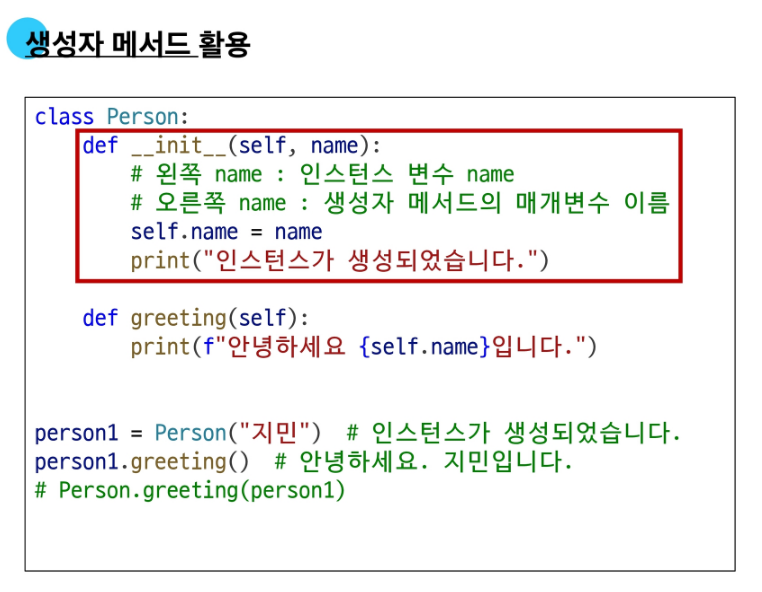
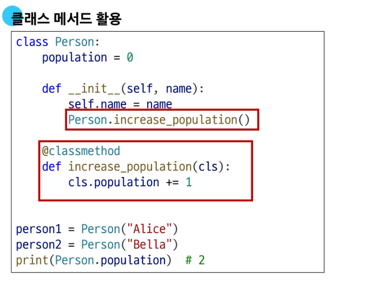
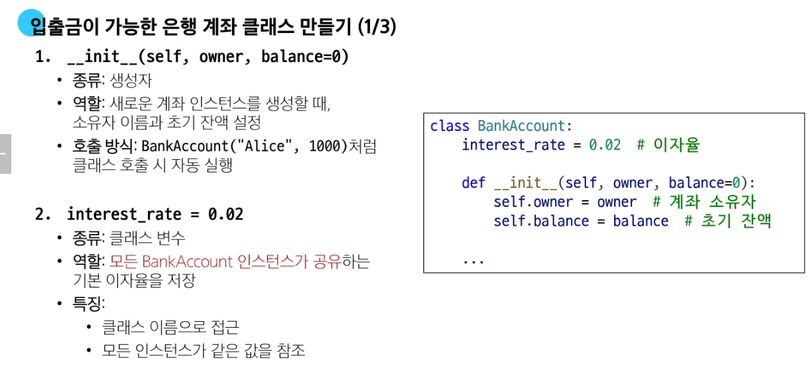
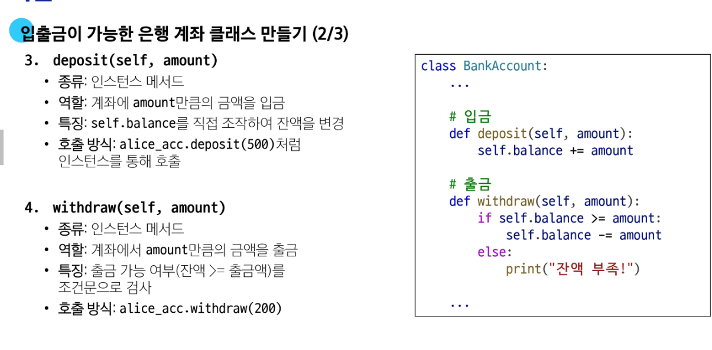
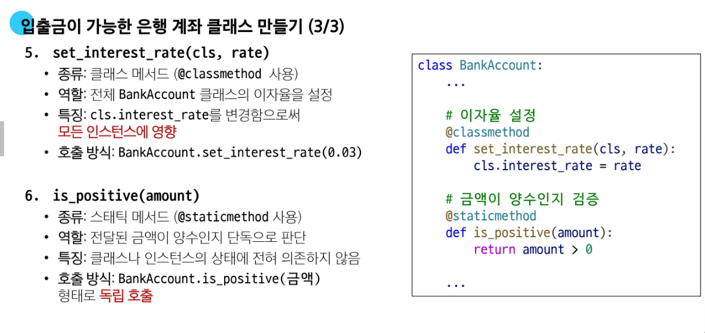
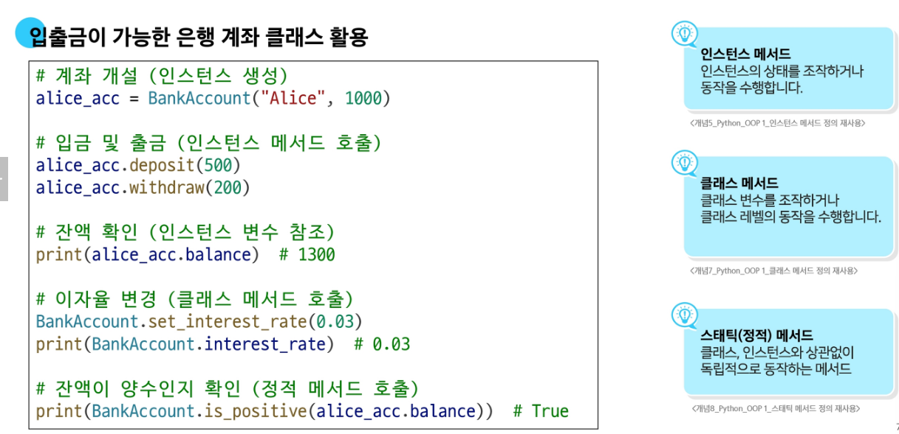
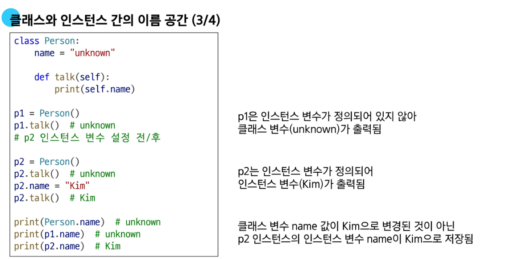
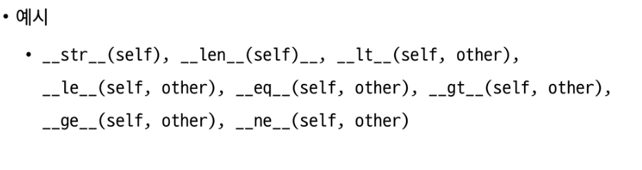
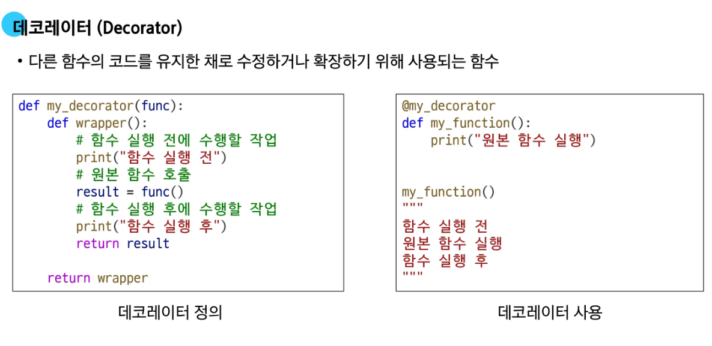

# Python OOP 정리

## 🧱 OOP (Object-Oriented Programming)
- 프로그램을 변수와 메서드를 하나의 **객체**로 묶어 조직적으로 관리함

## 🧩 클래스 (Class)
- 변수와 함수를 함께 정의하는 도구
- 클래스를 만드는 것은 새로운 **데이터 타입**을 만드는 행위임

## 🧍 인스턴스 (Instance)
- 클래스에서 생성된 **개별 객체**
- 각 인스턴스는 서로 **독립적**임

## 🏗️ 클래스의 구조
- 클래스는 다음 구성 요소로 이루어짐:
  - **생성자 메서드 (`__init__`)**: 인스턴스 변수 초기화
  - **인스턴스 변수**: `self.변수명` 형식으로 정의됨
  - **클래스 변수**: 클래스 블록 내에서 직접 정의되는 변수
- 같은 이름이 클래스와 인스턴스에 모두 존재할 경우 → **인스턴스 변수가 우선**


## 🔧 메서드 (Method)
- 클래스 내부에 정의된 **함수**
- 특정 동작 또는 상태를 정의

### ✅ 인스턴스 메서드
- `self`를 첫 인자로 받음
- 인스턴스 상태 변경 및 동작 정의
```python
class Person:
    def greeting(self):
        return "Hello!"

p = Person()
print(p.greeting())  # Hello!
```
- 예: `'hello'.upper()`는 내부적으로 `str.upper('hello')`로 실행됨

### ✅ 생성자 메서드 (`__init__`)
- 객체가 생성될 때 자동 호출
- 주로 인스턴스 변수 초기화에 사용
```python
class Circle:
    def __init__(self, radius):
        self.radius = radius
```


### ✅ 클래스 메서드 (`@classmethod`)
- 클래스 자체를 대상으로 동작
- 첫 인자로 `cls`를 받음
```python
class Counter:
    count = 0

    @classmethod
    def increment(cls):
        cls.count += 1
```


### ✅ 스태틱 메서드 (`@staticmethod`)
- 클래스나 인스턴스 상태에 **의존하지 않음**
- `self`, `cls` 인자를 받지 않음
```python
class Util:
    @staticmethod
    def add(a, b):
        return a + b
```

## 🧠 메서드 용도 비교

| 메서드 종류       | 첫 인자 | 용도                           | 상태 접근 가능 여부 |
|------------------|---------|--------------------------------|----------------------|
| 인스턴스 메서드  | `self`  | 인스턴스 상태 조회 및 변경     | ✅                   |
| 클래스 메서드    | `cls`   | 클래스 상태 조회 및 조작       | ✅ (클래스만)        |
| 스태틱 메서드    | 없음    | 독립 기능 구현                 | ❌                   |

> ✅ 클래스에서는 클래스/스태틱 메서드 사용 권장  
> ✅ 인스턴스에서는 인스턴스 메서드 사용 권장






## 📦 클래스와 인스턴스의 이름 공간
- 속성 접근 시, **인스턴스 → 클래스** 순으로 탐색함
- 동일 이름이 중복될 경우 **인스턴스 속성 우선**


## ✨ 매직 메서드 (Magic Methods)
- `__이름__` 형식의 특수 메서드
- 연산자 동작, 문자열 표현 등을 **오버로딩(재정의)**할 수 있음

예시: `__str__()`은 객체를 문자열로 표현할 때 사용됨

```python
class Circle:
    def __init__(self, radius):
        self.radius = radius

    def __str__(self):
        return f"원의 반지름 : {self.radius}"

c = Circle(3)
print(c)  # 원의 반지름 : 3
```


## 🧙 데코레이터 (Decorator)
- 함수나 메서드의 동작을 **변경하지 않고 확장**하기 위한 문법
- 함수 위에 `@` 문법으로 사용됨

```python
def decorator(func):
    def wrapper():
        print("Before function")
        func()
        print("After function")
    return wrapper

@decorator
def say_hello():
    print("Hello!")

say_hello()
```
