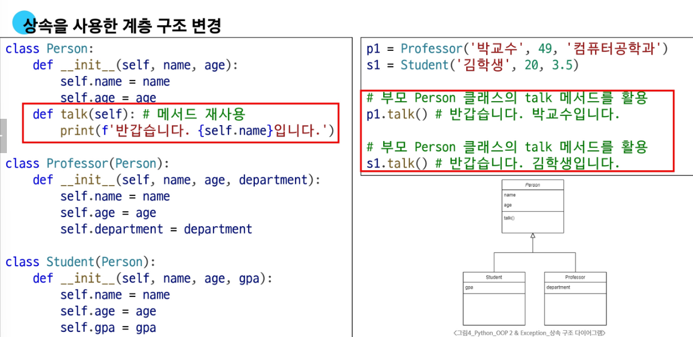
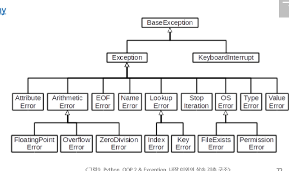

# 🐍 Python 상속과 예외 처리 정리

## 📚 상속 (Inheritance)
- 부모의 속성과 메서드를 자식 클래스가 물려받는 것
- 속성과 메서드를 자식에게 넘겨주는 구조
- 상속 시 부모 클래스의 이름을 자식 클래스 정의 시 괄호에 명시함
- 상속을 활용하여 계층 구조를 만들 수 있음



```python
class Animal:
    def speak(self):
        print("동물이 소리를 냅니다.")

class Dog(Animal):
    def speak(self):
        print("멍멍")
```

---

## 🧬 메서드 오버라이딩 (Overriding)
- 부모 클래스의 메서드를 **같은 이름, 같은 파라미터 구조로 재정의**하는 것
- 자바 등에서는 **오버로딩(Overloading)**도 지원하지만, 파이썬에서는 같은 이름의 함수가 있으면 **가장 마지막에 정의된 함수만 사용됨**

```python
class Parent:
    def greet(self):
        print("Hello")

class Child(Parent):
    def greet(self):  # 오버라이딩
        print("Hi")
```

---

## 🧬 다중 상속 (Multiple Inheritance)
- 둘 이상의 부모 클래스로부터 속성과 메서드를 상속받는 것
- 속성이나 메서드가 겹치는 경우, **MRO(Method Resolution Order)**에 따라 결정됨
- 기본적으로 **왼쪽에서 오른쪽**으로 우선순위를 가짐

```python
class A:
    def hello(self):
        print("A")

class B:
    def hello(self):
        print("B")

class C(A, B):  # MRO: C → A → B
    pass

C().hello()  # 출력: A
```

```python
print(C.__mro__)  # (<class '__main__.C'>, <class '__main__.A'>, <class '__main__.B'>, <class 'object'>)
```

---

## 🦸‍♂️ `super()` 메서드
- 부모 클래스의 메서드를 호출할 때 사용하는 내장 함수
- `super()`는 **MRO를 따라 상위 클래스를 순차적으로 호출**
- 주로 생성자(`__init__`)나 오버라이딩된 메서드 안에서 사용

### ✅ 단일 상속에서 `super()`

_example.png)

```python
class Parent:
    def __init__(self):
        print("Parent init")

class Child(Parent):
    def __init__(self):
        super().__init__()  # 부모 생성자 호출
        print("Child init")
```

### ✅ 다중 상속에서 `super()`

_example.png)

- 모든 상위 클래스가 `super().__init__()`을 호출해야 전체 체인이 완성됨
- `Child.__init__()`에서 `super().__init__()` 한 번만 쓰더라도, 상위 클래스들이 모두 `super()`를 사용하면 MRO 순서에 따라 다 호출됨
- `**kwargs`를 쓰면 각 클래스가 필요한 인자만 꺼내 쓸 수 있어 유연함

```python
class A:
    def __init__(self, a, **kwargs):
        self.a = a
        super().__init__(**kwargs)

class B:
    def __init__(self, b, **kwargs):
        self.b = b
        super().__init__(**kwargs)

class C(A, B):
    def __init__(self, a, b, c):
        super().__init__(a=a, b=b)
        self.c = c
```

---

## 🧪 디버깅 (Debugging)
- `print()`로 값 확인
- IDE 디버깅 기능 (예: breakpoint, step-in/out)
- [Python Tutor](https://pythontutor.com)로 시각적으로 실행 흐름 확인
- 뇌컴파일, 눈디버깅(?) 등은 비공식적이지만 직관 훈련에 도움

---

## 🧨 에러와 예외 (Error vs Exception)

### ✅ 에러 종류

| 종류 | 설명 |
|------|------|
| SyntaxError | 문법 오류 |
| ZeroDivisionError | 0으로 나누는 연산 |
| NameError | 정의되지 않은 이름 사용 |
| TypeError | 타입 불일치, 인자 누락/과다 |
| ValueError | 타입은 맞지만 부적절한 값 |
| IndexError | 존재하지 않는 인덱스 접근 |

```python
int('1.5')            # ValueError
range(3).index(6)     # ValueError
'2' + 2               # TypeError
sum()                 # TypeError: missing argument
random.sample(1, 2)   # TypeError
```

---

## 🛠️ 예외 처리 (Exception Handling)

```python
try:
    # 위험한 코드
except ValueError:
    print("값 오류 발생")
except (IndexError, KeyError):
    print("인덱스나 키 오류")
except Exception as e:
    print("예외 발생:", e)
else:
    print("예외 없이 성공!")
finally:
    print("무조건 실행")
```

- `except`에 여러 예외를 튜플로 전달 가능
- 가장 포괄적인 `except Exception:`은 **항상 마지막에 위치해야 함**

---

### 📚 예외 클래스 계층 구조

- 모든 예외는 `BaseException`을 상속
- 일반적인 경우 `Exception`을 상속한 예외만 다루면 충분



---

## ✅ 기타

- `as` 키워드로 예외 객체를 변수로 받을 수 있음
- `try` 블록 안에 `if`-`else` 구문을 중첩해서 사용할 수 있음